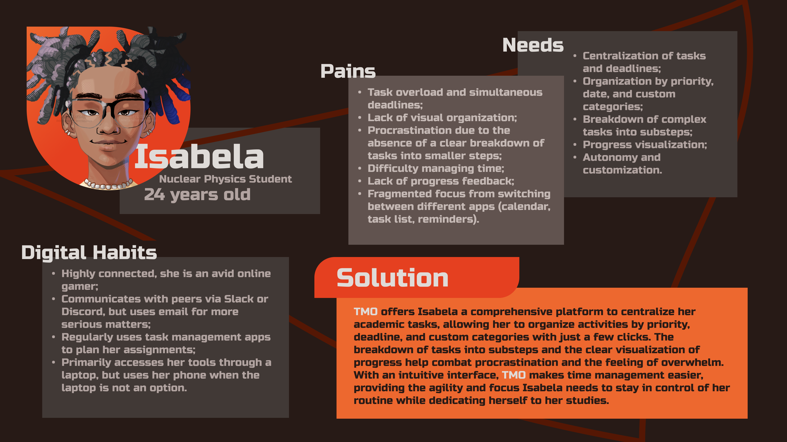

# Web Application Document - Projeto Individual - Módulo 2 - Inteli

**_Os trechos em itálico servem apenas como guia para o preenchimento da seção. Por esse motivo, não devem fazer parte da documentação final._**

## Nome do Projeto
TMO - Task Matrix Organizer

#### Autor do projeto
Lucas Michel Pereira

## Sumário

1. [Introdução](#c1)  
2. [Visão Geral da Aplicação Web](#c2)  
3. [Projeto Técnico da Aplicação Web](#c3)  
4. [Desenvolvimento da Aplicação Web](#c4)  
5. [Referências](#c5)  

 

## 1. Introdução (semana 3)

<!-- *Preencha com até 300 palavras – sem necessidade de fonte.*

*Descreva brevemente o sistema que você irá desenvolver.* -->

Este documento tem o objetivo de formalizar os processos de ideação, criação e a forma final da aplicação web *"TMO - Task Matrix Organizer"*, desenvolvida como projeto individual prático do módulo de desenvolvimento web do *Instituto de Tecnologia e Liderança (Inteli)*. O intuito do projeto é construir uma aplicação web funcional, atraente e que integre banco de dados, backend e frontend, aplicando conceitos e metodologias modernas de desenvolvimento.

O sistema *TMO* foi projetado para oferecer uma solução eficaz para o *gerenciamento pessoal de tarefas*, com grande priorização à organização e customização, sempre buscando otimizar mais e mais a produtividade e o conforto do usuário.

Dentre os diversos desafios que um projeto dessa complexidade oferece,
estão os seguintes:
- Utilização eficaz e entendimento profundo de bancos de dados.
- Criação de um front end agradável e intuitivo aos usuários.
- Adicionar indicações visuais e/ou subconcientes sobre todas as possibilidades de ações do usuário. Isto é, evitar que ele precise de um extenso tutorial apenas para a utilização da aplicação.
- Ideação e implementação de funcionalidades que ajudem o usuário a atingir seu objetivo.

Além disso, o desenvolvimento do *TMO* visa aplicar práticas sólidas de engenharia de software, sendo que cada decisão de design e tecnologia foi tomada com o objetivo de criar um sistema seguro e escalável, também possuindo fácil manutenção.

Este documento irá detalhar toda a jornada de construção do sistema, incluindo a definição da persona principal, levantamento de requisitos, arquitetura da solução, tecnologias utilizadas e fluxos de navegação.

Por fim, será apresentado também o planejamento para futuras melhorias, a fim de garantir que *TMO* possa evoluir de forma contínua e acompanhar novas demandas dos usuários.

---

## 2. Visão Geral da Aplicação Web

### 2.1. Personas

<!-- *Posicione aqui suas Personas em forma de texto markdown com imagens, ou como imagem de template preenchido. Atualize esta seção ao longo do módulo se necessário.* -->

  FIGURA 1 - Persona  
   
  Fonte: Material produzido pelo autor, imagem de perfil feita usando https://picrew.me/en/image_maker/2435758, 2025

### 2.2. User Stories

<!-- *Posicione aqui a lista de User Stories levantadas para o projeto. Siga o template de User Stories e utilize a mesma referência USXX no roadmap de seu quadro Kanban. Indique todas as User Stories mapeadas, mesmo aquelas que não forem implementadas ao longo do projeto. Não se esqueça de explicar o INVEST das 5 User Stories prioritárias.* -->

**US01** | Como estudante universitária, quero organizar minhas tarefas do modo que julgar melhor - seja por urgência, data ou outras categorias customizadas - para não perder tempo relembrando cada uma delas e organizando-as mentalmente.

A user story acima é: 
- **I - Independente** pois a capacidade de organizar tarefas por diferentes critérios pode ser implementada sem depender diretamente de outras funcionalidades.

- **N – Negociável** pois existem diferentes formas de implementar essa organização, como lista simples, filtros, ou até arrastar tarefas (drag-and-drop), fornecendo grande maleabilidade à sua implementação.

- **V – Valiosa** pois atende diretamente as dores da persona (Isabela), fazendo com que os usuários consigam organizar suas tarefas de maneira mais eficiente, personalizada e completa.

- **E – Estimável** pois é clara o suficiente para que seja possível estimar o esforço necessário para implementar as funcionalidades de criar filtros, permitir customização e salvar essas preferências.

- **S – Small (Pequena)** pois é pequena o bastante para ser desenvolvida dentro de um curto período de tempo mas sem que sua adição chegue a ser insignificante.

- **T – Testável** pois pode-se criar testes para validar que o usuário consegue organizar tarefas pelos critérios definidos e que essas preferências são aplicadas corretamente.

**US02** | Como estudante universitária, quero poder dividir tarefas grandes em subtarefas para que eu possa acompanhar o andamento delas mais facilmente e evitar atrasos.

**US03** | Como estudante universitária, quero visualisar o meu progresso do dia/semana com relação ao planejado para evitar que eu me sinta desmotivada e perdida.

---

## 3. Projeto da Aplicação Web

### 3.1. Modelagem do banco de dados  (Semana 3)

*Posicione aqui os diagramas de modelos relacionais do seu banco de dados, apresentando todos os esquemas de tabelas e suas relações. Utilize texto para complementar suas explicações, se necessário.*

*Posicione também o modelo físico com o Schema do BD (arquivo .sql)*

### 3.1.1 BD e Models (Semana 5)
*Descreva aqui os Models implementados no sistema web*

### 3.2. Arquitetura (Semana 5)

*Posicione aqui o diagrama de arquitetura da sua solução de aplicação web. Atualize sempre que necessário.*

**Instruções para criação do diagrama de arquitetura**  
- **Model**: A camada que lida com a lógica de negócios e interage com o banco de dados.
- **View**: A camada responsável pela interface de usuário.
- **Controller**: A camada que recebe as requisições, processa as ações e atualiza o modelo e a visualização.
  
*Adicione as setas e explicações sobre como os dados fluem entre o Model, Controller e View.*

### 3.3. Wireframes

*Posicione aqui as imagens do wireframe construído para sua solução e, opcionalmente, o link para acesso (mantenha o link sempre público para visualização).*

### 3.4. Guia de estilos

*Descreva aqui orientações gerais para o leitor sobre como utilizar os componentes do guia de estilos de sua solução.*

#### 3.4.1. Cores

*Apresente aqui a paleta de cores, com seus códigos de aplicação e suas respectivas funções.*

#### 3.4.2. Tipografia

*Apresente aqui a tipografia da solução, com famílias de fontes e suas respectivas funções.*

#### 3.4.3. Iconografia e imagens 

*(esta subseção é opcional, caso não existam ícones e imagens, apague esta subseção)*

*Posicione aqui imagens e textos contendo exemplos padronizados de ícones e imagens, com seus respectivos atributos de aplicação, utilizadas na solução.*

### 3.5. Protótipo de alta fidelidade

*Posicione aqui algumas imagens demonstrativas de seu protótipo de alta fidelidade e o link para acesso ao protótipo completo (mantenha o link sempre público para visualização).*

### 3.6. WebAPI e endpoints (Semana 5)

*Utilize um link para outra página de documentação contendo a descrição completa de cada endpoint. Ou descreva aqui cada endpoint criado para seu sistema.*  

### 3.7 Interface e Navegação (Semana 7)

*Descreva e ilustre aqui o desenvolvimento do frontend do sistema web, explicando brevemente o que foi entregue em termos de código e sistema. Utilize prints de tela para ilustrar.*

---

## 4. Desenvolvimento da Aplicação Web (Semana 8)

### 4.1 Demonstração do Sistema Web (Semana 8)

*VIDEO: Insira o link do vídeo demonstrativo nesta seção*
*Descreva e ilustre aqui o desenvolvimento do sistema web completo, explicando brevemente o que foi entregue em termos de código e sistema. Utilize prints de tela para ilustrar.*

### 4.2 Conclusões e Trabalhos Futuros (Semana 8)

*Indique pontos fortes e pontos a melhorar de maneira geral.*
*Relacione também quaisquer outras ideias que você tenha para melhorias futuras.*

---

## 5. Referências

_Incluir as principais referências de seu projeto, para que seu parceiro possa consultar caso ele se interessar em aprofundar. Um exemplo de referência de livro e de site:_ 

---
---