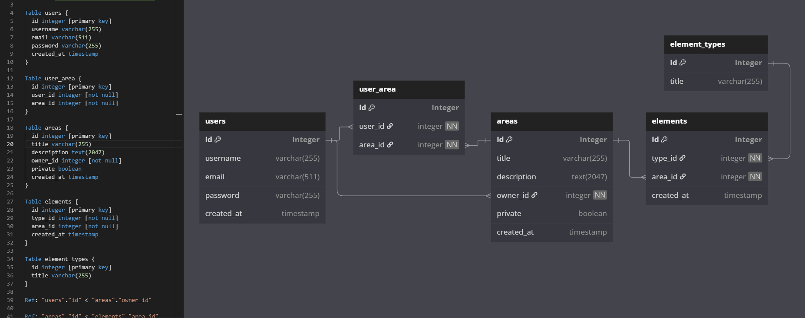
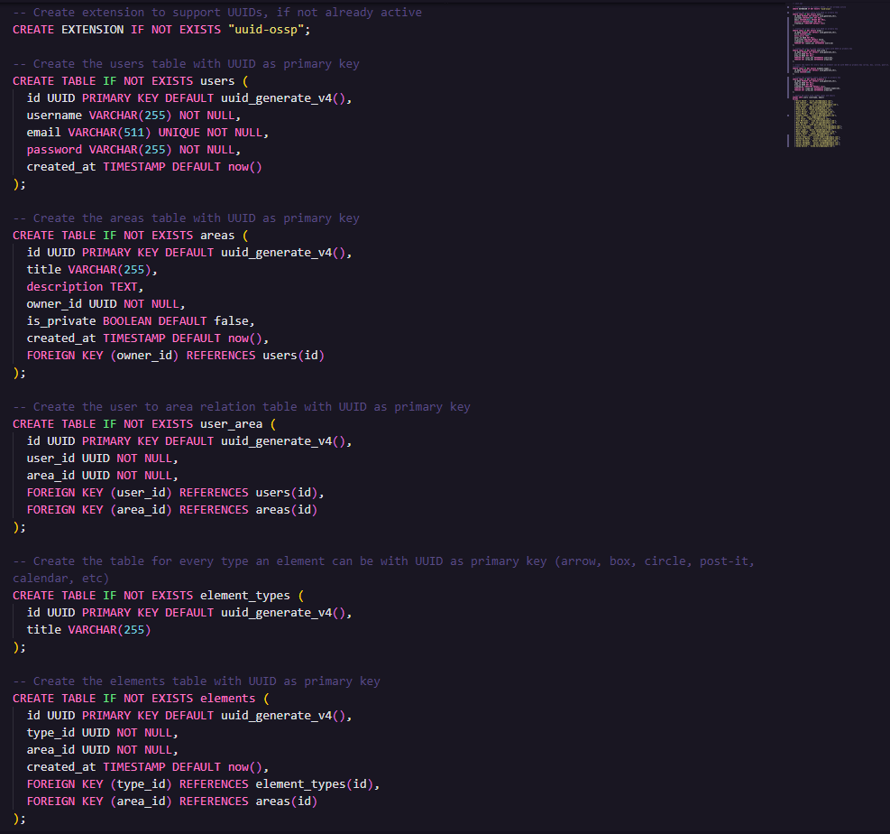
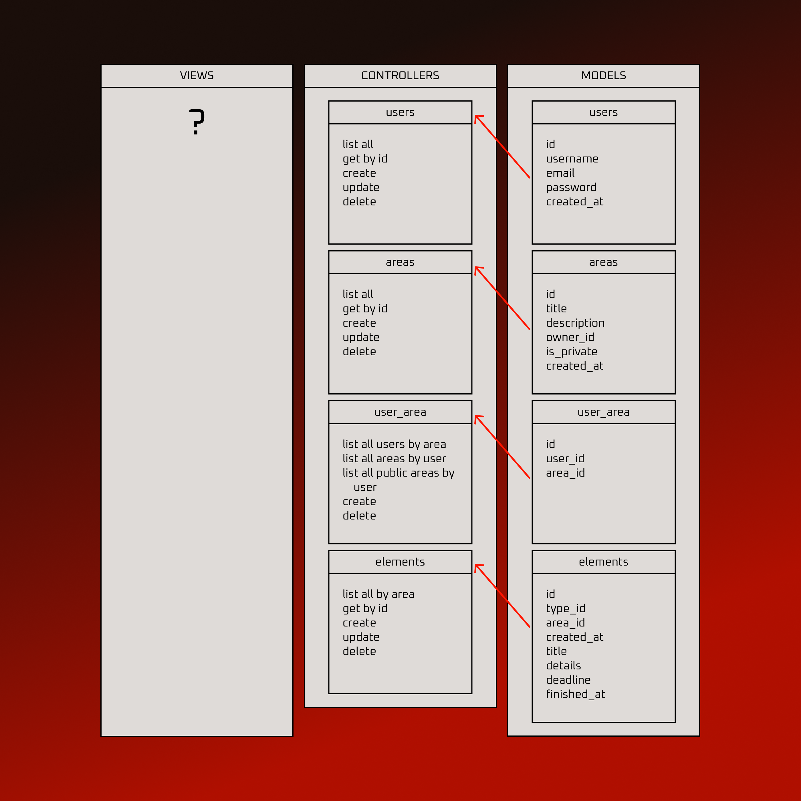
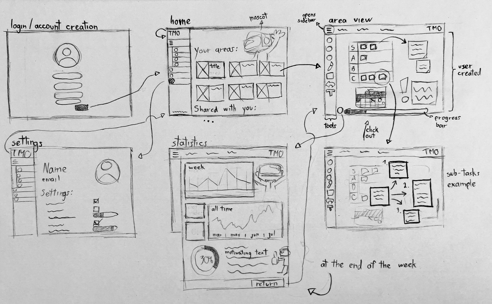
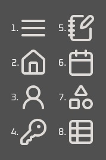
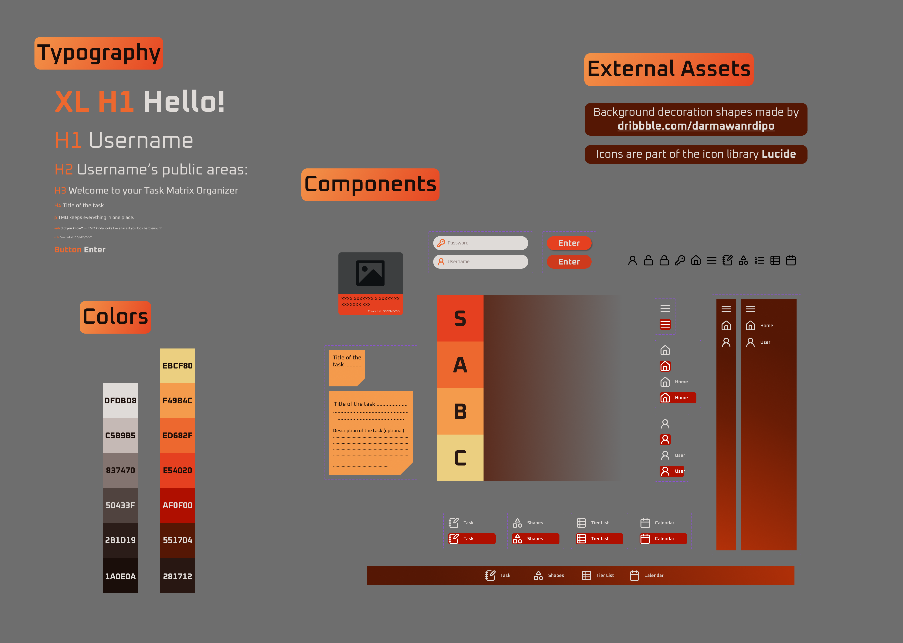

# Web Application Document - Projeto Individual - Módulo 2 - Inteli

**_Os trechos em itálico servem apenas como guia para o preenchimento da seção. Por esse motivo, não devem fazer parte da documentação final._**

## Project Name
TMO - Task Matrix Organizer

#### Project Author
Lucas Michel Pereira

## Table of Contents

1. [Introduction](#c1)  
2. [Overview of the Web Application](#c2)  
3. [Technical Design of the Web Application](#c3)  
4. [Web Application Development](#c4)  
5. [References](#c5)  

<br>

## <a name="c1"></a>1. Introduction (semana 3)

<!-- *Preencha com até 300 palavras – sem necessidade de fonte.*

*Descreva brevemente o sistema que você irá desenvolver.* -->

This document aims to formalize the ideation process, creation, and final form of the web application **"TMO - Task Matrix Organizer"**, developed as an individual practical project for the web development module at the **Institute of Technology and Leadership (Inteli)**. The goal of the project is to build a functional and appealing web application that integrates a database, backend, and frontend, applying modern development concepts and methodologies.

The **TMO** system was designed to offer an effective solution for **personal task management**, with strong emphasis on organization and customization, always aiming to continuously optimize user productivity and comfort.

Among the many challenges presented by a project of this complexity are the following:
- Effective use and deep understanding of databases.
- Creating a pleasant and intuitive frontend for users.
- Adding visual and/or subconscious cues for all possible user actions — that is, avoiding the need for an extensive tutorial just to use the application.
- Ideating and implementing features that help users achieve their goals.

Additionally, the development of **TMO** aims to apply solid software engineering practices, with every design and technology decision made to create a secure, scalable, and easily maintainable system.

This document will detail the entire journey of building the system, including the definition of the main persona, requirements gathering, solution architecture, technologies used, and navigation flows.

Finally, a plan for future improvements will also be presented to ensure that **TMO** can continue evolving and meet new user demands.

---

## <a name="c2"></a>2. Overview of the Web Application

### 2.1. Personas

<!-- *Posicione aqui suas Personas em forma de texto markdown com imagens, ou como imagem de template preenchido. Atualize esta seção ao longo do módulo se necessário.* -->

<div align="center">
  <sub>FIGURE 1 - Persona </sub><br>
  <br>
  <sup>Source: Material created by the author, profile image made using https://picrew.me/en/image_maker/2435758, 2025</sup>
</div>

### 2.2. User Stories

<!-- *Posicione aqui a lista de User Stories levantadas para o projeto. Siga o template de User Stories e utilize a mesma referência USXX no roadmap de seu quadro Kanban. Indique todas as User Stories mapeadas, mesmo aquelas que não forem implementadas ao longo do projeto. Não se esqueça de explicar o INVEST das 5 User Stories prioritárias.* -->

**US01** | As a university student, I want to organize my tasks in the way I find best — whether by urgency, date, or other custom categories — so I don't waste time recalling each one and organizing them mentally.
The user story above is:

- **I – Independent** because the ability to organize tasks by different criteria can be implemented without directly depending on other functionalities.

- **N – Negotiable** because there are different ways to implement this organization, such as a simple list, filters, or even dragging tasks (drag-and-drop), providing great flexibility for its implementation.

- **V – Valuable** because it directly addresses the pain points of the persona (Isabela), allowing users to organize their tasks in a more efficient, personalized, and complete way.

- **E – Estimable** because it is clear enough to estimate the effort needed to implement functionalities such as creating filters, allowing customization, and saving these preferences.

- **S – Small** because it is small enough to be developed in a short period of time, but still significant enough to add value.

- **T – Testable** because it’s possible to create tests to validate that the user can organize tasks by the defined criteria and that these preferences are applied correctly.

**US02** | As a university student, I want to be able to break down large tasks into subtasks so that I can more easily track their progress and avoid delays.

**US03** | As a university student, I want to visualize my progress for the day/week compared to what was planned so that I don’t feel unmotivated or lost.

---

## <a name="c3"></a>3. Technical Design of the Web Application

### 3.1. Modelagem do banco de dados  (Semana 3)

<!-- *Posicione aqui os diagramas de modelos relacionais do seu banco de dados, apresentando todos os esquemas de tabelas e suas relações. Utilize texto para complementar suas explicações, se necessário.*

*Posicione também o modelo físico com o Schema do BD (arquivo .sql)* -->

<div align="center">
  <sub>FIGURE 2 - Relational database model </sub><br>
  <br>
  <sup>Source: Diagram created by the author using dbdiagram.io, 2025</sup>
</div>

<div align="center">
  <sub>FIGURE 3 - Database's code </sub><br>
  <br>
  <sup>Source: Material created by the author, 2025</sup>
</div>

This database schema is designed to support a collaborative, visual workspace application. It manages users, work areas, access control, and visual elements like shapes or annotations that users can place in different areas. All primary keys use UUIDs to ensure global uniqueness and scalability.

#### **1. users Table**

- **Purpose:** Stores information about each user in the system.

- **Fields:**

  - *id:* Unique identifier (UUID).
  - *username:* Display name of the user.
  - *email:* Unique email address used for login.
  - *password:* Hashed user password.
  - *created_at:* Timestamp of when the user account was created.

- **Relationships:**

  - One user can own multiple areas *(areas.owner_id)*.
  - Users can be granted access to multiple areas through the *user_area* table.

#### **areas Table**

- **Purpose:** Represents a workspace or canvas where users can collaborate and place elements.

- **Fields:**

  - *id:* Unique identifier (UUID).
  - *title:* Name of the area.
  - *description:* Optional description of the area.
  - *owner_id:* The users.id of the area creator.
  - *is_private:* Boolean flag indicating if the area is private.
  - *created_at:* Timestamp of area creation.

- **Relationships:**

  - Each area is owned by one user *(owner_id → users.id)*.
  - An area can have many users with access through *user_area*.
  - An area can contain multiple visual elements *(elements.area_id)*.

#### **user_area Table**

- **Purpose:** Defines a many-to-many relationship between users and areas. Allows multiple users to access and collaborate on an area.

- **Fields:**

  - *id:* Unique identifier (UUID).
  - *user_id:* Foreign key to users.id.
  - *area_id:* Foreign key to areas.id.

- **Relationships:**

  - Connects a user to an area they have access to.
  - One user can be connected to many areas.
  - One area can be accessed by many users.

#### **element_types Table**

- **Purpose:** Catalog of possible types of visual elements (e.g., box, arrow, sticky note).

- **Fields:**

  - *id:* Unique identifier (UUID).
  - *title:* Name of the element type (e.g., "box", "arrow", etc).

- **Relationships:**

  - One element type can be used by many elements in different areas.

#### **elements Table**

- **Purpose:** Stores the actual elements placed inside an area (e.g., a specific box or arrow).

- **Fields:**

  - *id:* Unique identifier (UUID).
  - *type_id:* Foreign key to element_types.id.
  - *area_id:* Foreign key to areas.id.
  - *created_at:* Timestamp of when the element was created.

- **Relationships:**

  - Each element belongs to one area (area_id → areas.id).
  - Each element has one type (type_id → element_types.id).

#### **Entity Relationship Summary**

```
users   1 ────<   areas
users   1 ────<   user_area   >──── 1   areas
areas   1 ────<   elements
element_types   1 ────<   elements
```

**This structure enables:**

- Secure user management.
- Collaborative areas where multiple users can contribute.
- Typed visual elements in each workspace.
- Fine-grained access control through user_area.

### 3.1.1 BD e Models (Semana 5)
<!-- *Descreva aqui os Models implementados no sistema web* -->

In this application, the **Model** layer — temporarily implemented through service files — handles all direct interactions with the **PostgreSQL database**. It is responsible for executing SQL queries, managing data retrieval, insertion, updates, and deletion. Each model file corresponds to a key entity in the system.


### - `userService.js`

This service manages operations related to **users**.

#### Functions:
- `getAllUsers()` – Retrieves all users from the database.
- `getUserById(id)` – Retrieves a single user by their ID.
- `createUser(username, email)` – Inserts a new user into the database.
- `updateUser(id, username, email)` – Updates a user's details.
- `deleteUser(id)` – Removes a user from the database.

**Tables used**: `users`


### - `areaService.js`

This service handles logic for **areas** of the application, which are like workspaces or containers for grouped content.

#### Functions:
- `getAllAreas()` – Retrieves all areas from the database.
- `getAreaById(id)` – Fetches a specific area using its ID.
- `createArea(title, description, ownerId, isPrivate)` – Creates a new area and links it to the owner via the `user_area` relationship table.
- `updateArea(id, title, description, isPrivate)` – Updates the metadata of an area.
- `deleteArea(id)` – Deletes an area from the database.

**Tables used**: `areas`, `user_area`


### - `userAreaService.js`

This service manages the many-to-many relationship between users and areas.

#### Functions:
- `addUserToArea(userId, areaId)` – Links a user to an area.
- `getUsersByArea(areaId)` – Lists all users associated with a specific area.
- `getAllAreasByUser(userId)` – Retrieves all areas associated with a user.
- `getPublicAreasByUser(userId)` – Retrieves only public areas for a user.
- `removeUserFromArea(userId, areaId)` – Removes the relationship between a user and an area.

**Tables used**: `user_area`, `users`, `areas`


### - `elementService.js`

This service manages **elements**, which are individual items or tasks within an area.

#### Functions:
- `getElementsByArea(areaId)` – Lists all elements in a given area.
- `getElementById(id)` – Fetches a specific element by ID.
- `createElement({ type_id, area_id, title, details, deadline })` – Creates a new element, assigning a UUID and timestamp.
- `updateElement(id, data)` – Updates an existing element’s content or status.
- `deleteElement(id)` – Deletes an element.

**Tables used**: `elements`


#### Summary

These services abstract away raw SQL logic, making the rest of the application cleaner and easier to maintain. By organizing database interactions into focused service files, the app remains modular, scalable, and testable.


### 3.2. Arquitetura (Semana 5)

<!-- *Posicione aqui o diagrama de arquitetura da sua solução de aplicação web. Atualize sempre que necessário.*

**Instruções para criação do diagrama de arquitetura**  
- **Model**: A camada que lida com a lógica de negócios e interage com o banco de dados.
- **View**: A camada responsável pela interface de usuário.
- **Controller**: A camada que recebe as requisições, processa as ações e atualiza o modelo e a visualização.
  
*Adicione as setas e explicações sobre como os dados fluem entre o Model, Controller e View.* -->

<div align="center">
  <sub>FIGURE 4 - MVC Structure </sub><br>
  <br>
  <sup>Source: Diagram created by the author, 2025</sup>
</div>

For each main table in the database, there are matching **controllers** and **models** in the code, while **views** are dependent on what is shown to the user.

- The **controllers** handle actions like listing, creating, updating, and deleting data (CRUD).
- These actions are passed to the **models**, which interact with the database.
- The **views** are responsible for showing the information to the user (HTML pages).

### 3.3. Wireframes

<!-- *Posicione aqui as imagens do wireframe construído para sua solução e, opcionalmente, o link para acesso (mantenha o link sempre público para visualização).* -->

Below are the wireframes created for the **TMO – Task Matrix Organizer** application. These visual ideas reflect the core screens and user interactions planned for the final system. The wireframes are directly based on the functionalities described in the User Stories and cover the main usage and navigation flow of the application.

<div align="center">
  <sub>FIGURE 4 - Wireframe </sub><br>
  <br>
  <sup>Source: Diagram created by the author, 2025</sup>
</div>

Below is a description of the core wireframes designed for the TMO – Task Matrix Organizer. Each screen is tied to key user stories and reflects essential user interactions and functionalities of the system.

#### 1. Main Screen – Areas Overview

This is the initial screen users see after logging in. It displays all their task management areas in a clean, visual layout. Each area is represented with a title and image to make navigation intuitive and visually organized.

#### 2. Task Area – Task Dashboard

Within a selected area, users can create, manage, and move tasks using various visual tools, such as post-it notes, arrows, calendars, and tier lists. The screen is highly customizable while remaining easy to use.

*Related to US01 – Supports flexible and personalized task organization.*

#### 3. Task View – Task Details and Subtasks

This screen allows users to view and edit individual tasks. It includes fields for title, description, deadline, priority, and tags. Users can also create subtasks, mark them as completed, and monitor task-level progress.

*Related to US02 – Enables task breakdown for better progress tracking.*

#### 4. Statistics Screen – Progress Overview

This screen displays relevant productivity metrics, including daily/weekly progress tracking, long-term performance, and task completion rates. The interface is designed to be both informative and motivating, including progress bars and encouraging quotes.

*Related to US03 – Helps users stay engaged through visual progress feedback.*

**Note: This screen was not developed in the final product because of lack of initial knowledge and overall time constraints, which made the total completion of the inicial plans really difficult. But, I was able to understand the requirements to make such a screen and how I would come to execute it in the future.**

#### 5. Authentication – Login and Sign-Up

This screen enables secure access to the application. It includes email and password fields, buttons for login and registration, and a "Forgot password?" link, all while providing the right amount of validation through the process.

#### 6. Settings – User Preferences

This screen allows users to personalize their experience. Options include:

- Theme toggle (light/dark mode)
- Default task sorting preferences (e.g., by date, priority)
- Account management (name, email, password updates)
- Logout

*Related to US01 – Enhances customization and long-term usability.*

**Note: This screen was also scraped due to time limitations**

### 3.4. Style Guide

<!-- *Descreva aqui orientações gerais para o leitor sobre como utilizar os componentes do guia de estilos de sua solução.* -->

This section provides general guidance on how to use the visual components of the system, which are documented and organized in Figma. The goal is to help developers and designers apply the design consistently across all parts of the application.

**To use a component correctly:**

- Locate the component in the Figma Components or Assets panel.

- Use the pre-built variants instead of creating new styles from scratch.

- Follow the documented spacing and alignment shown in the Figma layout guides.

- Maintain consistent color and typography as specified in the corresponding sections below.

#### 3.4.1. Colors

<!-- *Apresente aqui a paleta de cores, com seus códigos de aplicação e suas respectivas funções.* -->

| Color Name      | Hex Code   | Usage Description                  | Preview             |
|-----------------|------------|------------------------------------|---------------------|
| White           | #DFDBD8  | Main text color, highlights        |  |
| Gray            | #837470  | Placeholder text on bright colors  |  |
| Black           | #1A0E0A  | Primary background color, text     |  |
| Yellow          | #EBCF80  | Decorations                        |  |
| Yellow orange   | #F49B4C  | Decorations, tasks                 |  |
| Orange          | #ED682F  | Secondary orange highlights        |  |
| Red orange      | #E54020  | Primary orange highlights          |  |
| Red             | #AF0F00  | Primary red, backgrounds, sidebar  |  |
| Dark red        | #551704  | Secondary background color         |  |
| Black red       | #281712  | Tertiary text color                |  |

#### 3.4.2. Typography

<!-- *Apresente aqui a tipografia da solução, com famílias de fontes e suas respectivas funções.* -->

The web application follows a specific typography style that can be seen in the following table. All fonts inside of the application are of the font family *Oxanium*, as to not overcomplicate the design.

| Size       | Weight(s) | Usage                     |
|------------|-----------|---------------------------|
| 128        | Bold      | Big heroes                |
| 96         | Regular   | H1, big headers           |
| 64         | Regular   | H2, section headers       |
| 40         | Medium    | H3, lesser headers        |
| 24         | Medium    | H4, small titles          |
| 20         | Regular   | p, body text              |
| 14         | Regular   | Subtitles                 |
| 12         | Regular   | Small details             |
| 36         | Bold      | Important buttons         |

#### 3.4.3. Iconography

<!-- *(esta subseção é opcional, caso não existam ícones e imagens, apague esta subseção)*

*Posicione aqui imagens e textos contendo exemplos padronizados de ícones e imagens, com seus respectivos atributos de aplicação, utilizadas na solução.* -->
In order for the user to understand what a button does, or what a section is about, before even reading anything, icons were used all around the application. Each of them has their own purpose, which must be followed thoroughly, as described below:

<div align="center">
  <sub>FIGURE 6 - Icons </sub><br>
  <br>
  <sup>Source: Diagram created by the author, 2025</sup>
</div>

1. Hamburger - Opens the sidebar, showing more details about each button in it
2. Home - Leads to the home page
3. User - Leads to your user page, or used to pass the idea of a user or username
4. Key - Indicates a password
5. Notebook - Represents tasks (on click, adds a task to the area)
6. Calendar - Represents a calendar (on click, adds a calendar to the area)
7. Shapes - Represents shapes (on click, adds a shape to the area)
8. Tierlist - Represents a tierlist (on click, adds a tierlist to the area)

### 3.5. High fidelity prototype

<!-- *Posicione aqui algumas imagens demonstrativas de seu protótipo de alta fidelidade e o link para acesso ao protótipo completo (mantenha o link sempre público para visualização).* -->

<div align="center">
  <sub>FIGURE 6 - High fidelity prototype </sub><br>
  <br>
  <sup>Source: Diagram created by the author, 2025</sup>
</div>

<div align="center">
  <sub>FIGURE 6 - Style guide </sub><br>
  <br>
  <sup>Source: Diagram created by the author, 2025</sup>
</div>

🔗 [View the full prototype](https://www.figma.com/design/FTmG5RzomQKCIjNPkwhx9e/TMO-Prototypes?m=auto&t=l0Hwv271JRcn2pEO-6)


### 3.6. WebAPI e endpoints (Semana 5)

*Utilize um link para outra página de documentação contendo a descrição completa de cada endpoint. Ou descreva aqui cada endpoint criado para seu sistema.*  

### 3.7 Interface e Navegação (Semana 7)

*Descreva e ilustre aqui o desenvolvimento do frontend do sistema web, explicando brevemente o que foi entregue em termos de código e sistema. Utilize prints de tela para ilustrar.*

---

## <a name="c4"></a>4. Web Application Development (Semana 8)

### 4.1 Demonstração do Sistema Web (Semana 8)

*VIDEO: Insira o link do vídeo demonstrativo nesta seção*
*Descreva e ilustre aqui o desenvolvimento do sistema web completo, explicando brevemente o que foi entregue em termos de código e sistema. Utilize prints de tela para ilustrar.*

### 4.2 Conclusões e Trabalhos Futuros (Semana 8)

*Indique pontos fortes e pontos a melhorar de maneira geral.*
*Relacione também quaisquer outras ideias que você tenha para melhorias futuras.*

---

## <a name="c5"></a>5. References

_Incluir as principais referências de seu projeto, para que seu parceiro possa consultar caso ele se interessar em aprofundar. Um exemplo de referência de livro e de site:_<br>

---
---